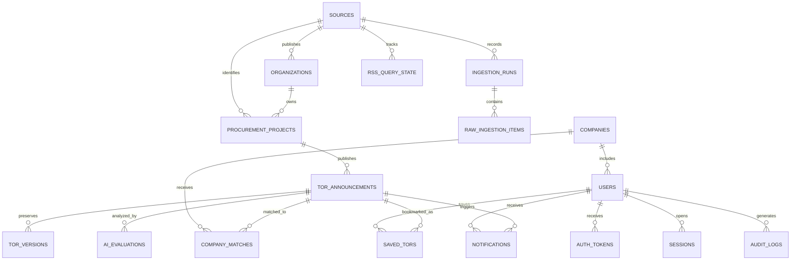

# TOR Software Database Model

## Relationship Overview

MongoDB references use `ObjectId` values. Relationships are shown here to communicate ownership; MongoDB does not enforce foreign keys automatically.

## 1. `sources`

Stores one record for each monitored public website.

Important fields:

- `code`: stable short name such as `EGP` or `BMA`
- `name`: publisher or source display name
- `baseUrl`: official website root
- `adapterType`: crawler implementation name
- `enabled`: whether scheduled collection is active
- `rawRetentionDays`: source-specific raw staging retention, normally `14`
- `crawlSchedule`: intended collection frequency and timezone
- `lastSuccessfulRunAt`: monitoring value

## 2. `organizations`

Represents agencies, departments, and purchasing units without separate tables for each level.

Important fields:

- `sourceId`: source that supplied the organization
- `externalId`: source-specific identifier when available
- `nameTh` and `nameEn`: display names
- `organizationType`: `agency`, `department`, or `purchasing_unit`
- `parentOrganizationId`: optional parent reference
- `ancestorIds`: ordered parent chain used for agency-wide filtering without recursive queries

## 3. `procurement_projects`

Represents one procurement project. A project can have many announcements or publications over its lifecycle.

Important fields:

- `sourceId`: source that supplied the project
- `externalProjectId`: source-specific project identifier, retained as a string
- `organizationId`: purchasing organization reference
- `title`, `summary`, and optional project-level metadata
- `createdAt` and `updatedAt`

The unique project identity is `sourceId + externalProjectId`.

## 4. `tor_announcements`

For the current RSS-only crawler stage, this collection stores the simplified feed item before any later normalization into the full TOR model.

Stores one announcement or publication, not the whole procurement project. The latest normalized state is used by the dashboard, search, filters, TOR detail page, and recommendations.

RSS-stage fields:

- `sourceId`, `departmentId`, `projectId`, and `templateId`
- `title`, `description`, `publishedAt`, and `url`
- `procurementMethod` and `announcementType`
- `channelParams` and `itemParams`
- `firstSeenAt` and `lastSeenAt`

The later normalized TOR model may add the following fields:

- `sourceId`: publishing source
- `procurementProjectId`: parent procurement project reference
- `announcementKey`: deterministic key derived from source announcement identifiers; do not use RSS `guid`
- `externalProjectId`, `templateType`, `tempAnnoun`, `tempItemNo`, and `seqNo`: source identifiers retained as strings
- `title`, `summary`, `category`, and `keywords`: searchable data
- `organization`: bounded display snapshot containing `organizationId`, optional external ID, Thai and English names, organization type, ancestor IDs, and optional purchasing-unit name
- `announcementType` and `procurementMethod`: source code and display name
- `budget`: amount or range in THB and source text
- `publishedAt`, `submissionDeadline`, `projectStartAt`, `projectEndAt`
- `sourceUrl`: original verification link
- `documents`: PDF metadata and storage locations
- `status`: `draft`, `open`, `closed`, `cancelled`, or `awarded`
- `version` and `contentHash`: change tracking
- `firstSeenAt` and `lastSeenAt`: crawler monitoring

The unique announcement identity is `sourceId + announcementKey`. `projectId` alone is not unique because one project can have many announcements.

Do not store large PDF binary data in this collection. Store files in Google Cloud Storage and retain metadata such as `sourceUrl`, `storageUrl`, `checksum`, `mimeType`, `pageCount`, and `fileSizeBytes`.

## 5. `tor_versions`

Stores immutable snapshots created only when normalized TOR content changes.

Important fields:

- `torId`, `version`, and `contentHash`
- `changeType`: `created`, `updated`, `cancelled`, or `restored`
- `changedFields`: fields that changed from the previous version
- `snapshot`: normalized source data at that version
- `rawItem`: optional raw source item, not the complete repeated feed
- `capturedAt`

## 6. `ingestion_runs`

Tracks each RSS fetch for the current crawler stage.

Required RSS-stage fields:

- `sourceId`: source code such as `EGP`
- `fetchedAt`: fetch timestamp as an ISO string or MongoDB date
- `request`: endpoint and non-secret request parameters
- `reportedCount` and `itemsReceived`: feed counts
- `complete`: whether the complete feed was retrieved

Optional fields:

- `channelParams`: RSS channel parameters
- `lastBuildDate`: source feed timestamp

The full crawler lifecycle fields can be added later when processing, retries, and operational auditing are introduced.

## 7. `raw_ingestion_items`

Temporarily isolates untrusted crawler output before it can enter the clean TOR collection.

Important fields:

- `ingestionRunId`, `sourceId`, and `environment`
- source URL, source identifiers, announcement key, and content hash
- raw payload or a cloud-storage pointer for large responses
- `processingStatus`: `pending`, `normalized`, `rejected`, or `failed`
- validation errors and an optional normalized preview
- `normalizedTorId` after successful processing, referencing `tor_announcements`
- `expiresAt` for automatic removal, normally 14 days after collection

## 8. `rss_query_state`

Tracks RSS queries and whether all results were retrieved, including split queries and retries.

Important fields:

- `sourceId`, `date`, `departmentId`, `subdepartmentId`, `announcementType`, and `methodId`
- `queryKey`: deterministic identity for the complete query parameter set
- `reportedCount`, `itemsReceived`, and `complete`
- `splitLevel`, `status`, `retryCount`, `nextRetryAt`, `lastCheckedAt`, and `lastIngestionRunId`

The unique query identity is `sourceId + queryKey`.

## 9. `users`

Stores application identity and access data.

Important fields:

- `email`, normalized email, and a secure `passwordHash`
- `profile`: first name, last name, phone, avatar, and job title
- `role`: `company_admin`, `company_member`, `project_manager`, or `system_admin`
- `companyId`: company membership when relevant
- `notificationPreferences.channels`: enabled delivery channels from `in_app` and `email`
- `notificationPreferences.alertTypes`: enabled alerts from `new_match`, `tor_updated`, and `deadline_reminder`
- `notificationPreferences.deadlineReminderDays`: optional reminder lead time from 1–30 days
- `status`: `pending_verification`, `active`, `suspended`, or `disabled`
- email verification, login, password-change, lock, terms-acceptance, and soft-deletion timestamps

## 10. `auth_tokens`

Stores short-lived authentication actions without storing usable raw tokens.

Important fields:

- `type`: `email_verification`, `password_reset`, or `company_invitation`
- `tokenHash`: one-way hash of the token sent to the user
- optional `userId` and `companyId`, plus normalized email
- `expiresAt`, `usedAt`, `revokedAt`, and `createdAt`

The expiry index removes expired records automatically. The raw token belongs only in the email link and must never be saved in MongoDB.

## 11. `sessions`

Stores refresh sessions so the backend can support logout, logout from all devices, and revocation after a password change.

Important fields:

- `userId` and hashed refresh token
- `status`: `active` or `revoked`
- optional user-agent and hashed IP address
- `expiresAt`, `lastUsedAt`, `revokedAt`, and `createdAt`

## 12. `audit_logs`

Records important security and account events.

Important fields:

- actor, target, event, and success/failure outcome
- request ID, optional device details, and safe metadata
- `createdAt`

Recommended events include registration, login success/failure, email verification, password reset, role changes, account suspension, and company verification.

`expiresAt` is optional. When present, the TTL index removes the record at that date. Omit it for security events that must be retained indefinitely or archived under a separate policy.

## 13. `companies`

Stores the software-house profile used for AI matching.

Important fields:

- legal and display names, company size, district, and contact data
- `technologies`: bounded list such as Next.js, Node.js, MongoDB, and Google Cloud
- `qualifications`: certification, capability, and experience evidence
- `profileCompleteness`: matching-readiness percentage
- `verificationStatus`: `unverified`, `pending`, `verified`, or `rejected`

## 14. `ai_evaluations`

Stores AI-derived information separately from official source facts.

Important fields:

- `torId` and `torVersion`
- `status`: `queued`, `processing`, `completed`, or `failed`
- `retryCount`, `lastAttemptAt`, and `nextAttemptAt`: retry and backoff state used by the worker queue
- `lastError`: structured code, message, and retryable flag for the latest failed attempt
- `requirements`: extracted requirement, category, importance, and evidence
- `budgetObservation`, `riskFlags`, and `summary`
- `model`: provider, name, version, and prompt version
- `generatedAt`

Every AI statement should include evidence text or a page reference when possible. The UI must label this information as AI-generated.

## 15. `company_matches`

Stores the evaluated relationship between one company and one TOR version.

Important fields:

- `companyId`, `torId`, and `torVersion`
- `score`: 0–100 compatibility score
- `recommendation`: `strong_match`, `possible_match`, or `not_recommended`
- `requirementMatches`: met, partial, or missing status with evidence
- `strengths`, `gaps`, and `explanation`
- `computedAt`

## 16. `saved_tors`

Stores one bookmark per user and TOR.

Important fields:

- `userId` and `torId`
- `note`
- `followUpStatus`: `watching`, `reviewing`, `preparing_bid`, `submitted`, or `dismissed`
- `createdAt` and `updatedAt`

## 17. `notifications`

Tracks in-app and email alerts.

Important fields:

- `eventKey`: idempotency value that prevents duplicate delivery
- `userId`, optional `companyId`, and optional `torId`
- `type`: `new_match`, `tor_updated`, `deadline_reminder`, or `system`
- `channel`: `in_app` or `email`
- `status`: `queued`, `sent`, `failed`, or `read`
- `attemptCount` and `nextAttemptAt`: delivery retry state
- `deliveryError`: structured code, message, and last-attempt timestamp
- `title`, `message`, `createdAt`, `sentAt`, and `readAt`

Workers should query queued or failed records using the `status + nextAttemptAt` index rather than repeatedly scanning all notifications.

## Feature-to-Collection Map

| Product feature | Main collections |
| --- | --- |
| Dashboard, search, and filters | `tor_announcements`, `sources`, `organizations` |
| Five-source crawler | `sources`, `procurement_projects`, `ingestion_runs`, `tor_announcements`, `tor_versions`, `rss_query_state` |
| Raw crawler validation and cleanup | `ingestion_runs`, `raw_ingestion_items` |
| TOR details, PDF reader, source link | `tor_announcements`, `tor_versions` |
| Company profile and qualifications | `companies`, `users` |
| Registration, login, and account recovery | `users`, `auth_tokens`, `sessions`, `audit_logs` |
| AI evaluation | `ai_evaluations`, `tor_announcements` |
| Matching and recommendations | `company_matches`, `companies`, `ai_evaluations` |
| Saved TORs and notifications | `saved_tors`, `notifications` |
