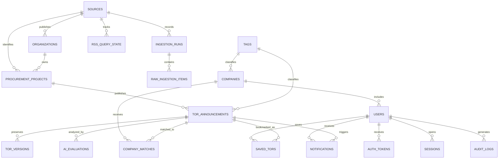

# TOR Software Database Model

## Relationship Overview



MongoDB references use `ObjectId` values. Relationships are shown here to communicate ownership; MongoDB does not enforce foreign keys automatically.

## 1. `sources`

Stores one record for each monitored public website.

Important fields:

- `code`: stable short name such as `EGP` or `BMA`
- `name`: publisher or source display name
- `baseUrl`: official website root
- `adapterType`: crawler implementation name
- `enabled`: whether scheduled collection is active
- `rawRetentionDays`: source-specific raw staging retention, normally `14`
- `crawlSchedule`: intended collection frequency and timezone
- `lastSuccessfulRunAt`: monitoring value

## 2. `organizations`

Represents agencies, departments, and purchasing units without separate tables for each level.

Important fields:

- `sourceId`: source that supplied the organization
- `externalId`: source-specific identifier when available
- `nameTh` and `nameEn`: display names
- `organizationType`: `agency`, `department`, or `purchasing_unit`
- `parentOrganizationId`: optional parent reference
- `ancestorIds`: ordered parent chain used for agency-wide filtering without recursive queries

## 3. `procurement_projects`

Represents one procurement project. A project can have many announcements or publications over its lifecycle.

Important fields:

- `sourceId`: source that supplied the project
- `externalProjectId`: source-specific project identifier, retained as a string
- `organizationId`: purchasing organization reference
- `title`, `summary`, and optional project-level metadata
- `createdAt` and `updatedAt`

The unique project identity is `sourceId + externalProjectId`.

## 4. `tor_announcements`

Stores procurement announcement publications ingested from public procurement portals.

In the current live system (verified against 70 live documents in MongoDB Atlas from `sourceId: "EGP"`), this collection stores the **Live RSS Ingestion Document Model**. In a subsequent processing stage, these records can be extended into the **Normalized TOR Model** for enriched full-text search, detailed organization hierarchies, and AI matching.

### Live Ingestion Schema (Current Atlas Database)

Every document ingested by the RSS crawler contains the following fields:

| Field | BSON Type | Nullable | Description & Live Examples |
| --- | --- | --- | --- |
| `_id` | `ObjectId` | No | Unique MongoDB document identifier. |
| `sourceId` | `string` | No | Originating source code (e.g., `"EGP"`). |
| `departmentId` | `string` | Yes | Source department code (e.g., `"0307"` for Thai Revenue Department / กรมสรรพากร). |
| `projectId` | `string` | Yes | Source procurement project identifier (e.g., `"69089624058"`). Not unique alone because one project can produce multiple announcements. |
| `templateId` | `string` | Yes | UUID identifier used by e-GP PDF download service (e.g., `"80c0d1e8-e215-41ad-8eb5-c03c33bce482"`). Set to `null` when the source link points to a legacy web/JSP query rather than a template PDF. |
| `title` | `string` | No | Thai announcement headline (e.g., `"ประกวดราคาจ้างเหมาบริการทำความสะอาด-ทำสวน ของสำนักงานสรรพากรพื้นที่ตาก..."`). Min length: 3 chars. |
| `description` | `string` | Yes | Formatted summary snippet from the RSS feed, typically matching `"${projectId}, ${procurementMethod}, ${announcementType}"`. |
| `publishedAt` | `string` \| `date` | Yes | Publication date. Currently stored as an ISO date string (`"YYYY-MM-DD"`, e.g., `"2026-09-02"`). |
| `url` | `string` | No | Verification link pointing to the PDF document or legacy search result page. Min length: 8 chars. |
| `procurementMethod` | `string` \| `object` | Yes | Procurement method name in Thai (e.g., `"ประกวดราคาอิเล็กทรอนิกส์ (e-bidding)"` or `"จ้างที่ปรึกษาโดยวิธีประกาศเชิญชวนทั่วไป"`). |
| `announcementType` | `string` \| `object` | Yes | Announcement type in Thai (e.g., `"ประกาศเชิญชวน"`). |
| `channelParams` | `object` | No | RSS channel query parameters captured during crawl (`homeflag`, `proc_id`, `servlet`, `methodId`, `announceType`). |
| `itemParams` | `object` | No | Source URL query parameters. Varies by announcement link type (see Item Parameter Variants below). |
| `tagAssignments` | `array` | Yes | Controlled tags assigned to the announcement. Each element contains `tagId`, `requirementLevel` (`required`, `preferred`, `informational`), `source` (`manual`, `ai`, `crawler`), `confidence` (0–1), `reviewStatus` (`suggested`, `approved`, `rejected`), `evidence`, `reviewedByUserId`, `reviewedAt`, and `assignedAt`. |
| `firstSeenAt` | `string` \| `date` | No | Timestamp when the crawler first captured this announcement (e.g., `"2026-09-02T19:05:38.161Z"`). |
| `lastSeenAt` | `string` \| `date` | No | Timestamp when the crawler last observed this announcement in the source feed (e.g., `"2026-09-02T19:05:38.161Z"`). |
| `updatedAt` | `date` | Yes | Timestamp of the last backend modification (e.g. tag assignments or administrative edits). |
| `updatedByUserId` | `ObjectId` | Yes | Reference to the user who performed the last modification. |

#### Item Parameter Variants (`itemParams`)

Analysis of live database records reveals two structural variants in `itemParams`:

1. **Standard Template PDF (Direct View Service)**:
   For e-bidding announcements where `url` points to `egp-template-service/dwnt/view-pdf-file`:
   ```json
   {
     "templateId": "80c0d1e8-e215-41ad-8eb5-c03c33bce482"
   }
   ```
2. **Legacy Web / JSP Search Result**:
   For consultancy or non-template announcements where `url` points to `egp2procmainWeb/jsp/procsearch.sch`:
   ```json
   {
     "servlet": "gojsp",
     "proc_id": "ShowHTMLFile",
     "processFlows": "Procure",
     "projectId": "69089266414",
     "templateType": "D2",
     "temp_Announ": "A",
     "temp_itemNo": "0",
     "seqNo": "0"
   }
   ```

#### Live Database Sample Documents

##### Variant 1: e-Bidding with Direct PDF Template
```json
{
  "_id": { "$oid": "6a9878268e3677918f092998" },
  "sourceId": "EGP",
  "departmentId": "0307",
  "projectId": "69089624058",
  "templateId": "80c0d1e8-e215-41ad-8eb5-c03c33bce482",
  "title": "ประกวดราคาจ้างเหมาบริการทำความสะอาด-ทำสวน ของสำนักงานสรรพากรพื้นที่ตาก และทำความสะอาดสำนักงานสรรพากรพื้นที่สาขาในสังกัด ในปีงบประมาณ พ.ศ. 2570 ด้วยวิธีประกวดราคาอิเล็กทรอนิกส์ (e-bidding)",
  "description": "69089624058, ประกวดราคาอิเล็กทรอนิกส์ (e-bidding), ประกาศเชิญชวน",
  "publishedAt": "2026-09-02",
  "url": "https://process5.gprocurement.go.th/egp-template-service/dwnt/view-pdf-file?templateId=80c0d1e8-e215-41ad-8eb5-c03c33bce482",
  "procurementMethod": "ประกวดราคาอิเล็กทรอนิกส์ (e-bidding)",
  "announcementType": "ประกาศเชิญชวน",
  "channelParams": {
    "homeflag": "A",
    "proc_id": "FPRO9965",
    "servlet": "FPRO9965Servlet",
    "methodId": "",
    "announceType": "2"
  },
  "itemParams": {
    "templateId": "80c0d1e8-e215-41ad-8eb5-c03c33bce482"
  },
  "firstSeenAt": "2026-09-02T19:05:38.161Z",
  "lastSeenAt": "2026-09-02T19:05:38.161Z"
}
```

##### Variant 2: General Consultation with HTML/JSP Parameter Bag
```json
{
  "_id": { "$oid": "6a9ef4b769505e45e1c7fa9c" },
  "sourceId": "EGP",
  "departmentId": "0307",
  "projectId": "69089266414",
  "templateId": null,
  "title": "จ้างที่ปรึกษาโครงการจ้างที่ปรึกษาการจัดทำระบบบริหารด้านการให้บริการและด้านความมั่นคงปลอดภัยสารสนเทศของศูนย์ปฏิบัติการเครือข่ายสื่อสาร กรมสรรพากร และศูนย์ปฏิบัติการความมั่นคงปลอดภัยและเฝ้าระวังความมั่นคงปลอดภัยสารสนเทศ กรมสรรพากร โดยวิธีประกาศเชิญชวนทั่วไป",
  "description": "69089266414, จ้างที่ปรึกษาโดยวิธีประกาศเชิญชวนทั่วไป, ประกาศเชิญชวน",
  "publishedAt": "2026-09-07",
  "url": "http://process.gprocurement.go.th/egp2procmainWeb/jsp/procsearch.sch?servlet=gojsp&proc_id=ShowHTMLFile&processFlows=Procure&projectId=69089266414&templateType=D2&temp_Announ=A&temp_itemNo=0&seqNo=0",
  "procurementMethod": "จ้างที่ปรึกษาโดยวิธีประกาศเชิญชวนทั่วไป",
  "announcementType": "ประกาศเชิญชวน",
  "channelParams": {
    "homeflag": "A",
    "proc_id": "FPRO9965",
    "servlet": "FPRO9965Servlet",
    "methodId": "",
    "announceType": "2"
  },
  "itemParams": {
    "servlet": "gojsp",
    "proc_id": "ShowHTMLFile",
    "processFlows": "Procure",
    "projectId": "69089266414",
    "templateType": "D2",
    "temp_Announ": "A",
    "temp_itemNo": "0",
    "seqNo": "0"
  },
  "firstSeenAt": "2026-09-07T17:30:31.393Z",
  "lastSeenAt": "2026-09-07T17:30:31.393Z"
}
```

### Active Database Indexes

The `tor_announcements` collection in MongoDB Atlas maintains the following 8 indexes:

1. `_id_`: Default unique primary key on `{ _id: 1 }`.
2. `uq_rss_tors_source_url`: **Unique** compound index on `{ sourceId: 1, url: 1 }` preventing duplicate feed item ingestion.
3. `ix_rss_tors_source_published`: Compound index on `{ sourceId: 1, publishedAt: -1 }` for source feed chronological ordering.
4. `ix_rss_tors_department_published`: Compound index on `{ departmentId: 1, publishedAt: -1 }` for departmental filtering.
5. `ix_rss_tors_type_published`: Compound index on `{ announcementType: 1, publishedAt: -1 }` for announcement category queries.
6. `ix_rss_tors_method_published`: Compound index on `{ procurementMethod: 1, publishedAt: -1 }` for procurement method filters.
7. `tx_rss_tors_discovery`: Text index on `{ title: "text", description: "text" }` with weights `{ title: 10, description: 2 }`, `default_language: "none"`, and `language_override: "language"` for keyword searches.
8. `ix_rss_tors_tags_level`: Compound index on `{ "tagAssignments.tagId": 1, "tagAssignments.requirementLevel": 1 }` for capability and requirement tag matching.

### Uniqueness & Identity Evolution

- **Current Live RSS Stage**: The unique document identity is `sourceId + url`, enforced by `uq_rss_tors_source_url`. `projectId` alone is not unique because a single procurement project regularly issues multiple announcements (e.g. preliminary draft TOR, public hearing, invitation, and amendment).
- **Future Normalized Stage**: When cross-source normalization is active, deduplication will transition to `sourceId + announcementKey` (where `announcementKey` is deterministically derived from source identifiers such as `projectId + templateType + tempAnnoun + tempItemNo + seqNo`), insulating against fluctuating query parameters and session tokens in source URLs.

### Future Normalized TOR Extension Fields

The later normalized TOR model expands this collection with the following domain fields for downstream AI and matching services:

- `procurementProjectId`: Parent procurement project reference (`ObjectId` linking to `procurement_projects`).
- `announcementKey`: Deterministic key derived from source announcement identifiers.
- `externalProjectId`, `templateType`, `tempAnnoun`, `tempItemNo`, and `seqNo`: Source identifiers retained as structured strings.
- `summary`, `category`, and `keywords`: Processed full-text searchable data.
- `organization`: Bounded display snapshot containing `organizationId`, optional external ID, Thai and English names, organization type, ancestor IDs, and optional purchasing-unit name.
- `budget`: Structured amount or range in THB (`minAmount`, `maxAmount`) and source text representation.
- `publishedAt`, `submissionDeadline`, `projectStartAt`, `projectEndAt`: Standardized BSON `date` timestamps.
- `sourceUrl`: Original verification link.
- `documents`: PDF metadata and storage locations (`sourceUrl`, `storageUrl`, `checksum`, `mimeType`, `pageCount`, `fileSizeBytes`).
- `status`: `draft`, `open`, `closed`, `cancelled`, or `awarded`.
- `version` and `contentHash`: Change tracking for version creation.

> [!NOTE]
> **PDF Storage Policy**: Do not store large PDF binary files directly in MongoDB documents. Store documents in Google Cloud Storage and maintain references and metadata in `documents`.

### Current e-GP Thumbnail Fields

- `departmentName`: agency display name captured with `departmentId`.
- `documentUrl`: actual PDF or document URL when it differs from the announcement verification `url`.
- `thumbnail`: backend route reference such as `/api/thumbnail/{templateId}`; it is never the Base64 image data.
- `status`: `draft`, `open`, `closed`, `cancelled`, or `awarded`. Legacy records without this field are treated as open by the backend list API.

## Thumbnail storage (`thumbnails`)

Stores the generated first-page image separately from `tor_announcements`.

Important fields:

- `templateId`: unique e-GP template linkage to the TOR announcement.
- `projectId`: optional source project identifier.
- `contentType`: normally `image/webp`.
- `data`: Base64-encoded image bytes; this field is served only through `GET /api/thumbnail/:templateId` and is never included in TOR JSON responses.
- `sourceUrl`, `width`, `quality`, `size`, and `updatedAt`: generation and cache metadata.

The backend returns `404` when a thumbnail is missing. Frontend cards and detail views must show a document placeholder in that case.

## 5. `tor_versions`

Stores immutable snapshots created only when normalized TOR content changes.

Important fields:

- `torId`, `version`, and `contentHash`
- `changeType`: `created`, `updated`, `cancelled`, or `restored`
- `changedFields`: fields that changed from the previous version
- `snapshot`: normalized source data at that version
- `rawItem`: optional raw source item, not the complete repeated feed
- `capturedAt`

## 6. `ingestion_runs`

Tracks each RSS fetch for the current crawler stage.

Required RSS-stage fields:

- `sourceId`: source code such as `EGP`
- `fetchedAt`: fetch timestamp as an ISO string or MongoDB date
- `request`: endpoint and non-secret request parameters
- `reportedCount` and `itemsReceived`: feed counts
- `complete`: whether the complete feed was retrieved

Optional fields:

- `channelParams`: RSS channel parameters
- `lastBuildDate`: source feed timestamp

The full crawler lifecycle fields can be added later when processing, retries, and operational auditing are introduced.

## 7. `raw_ingestion_items`

Temporarily isolates untrusted crawler output before it can enter the clean TOR collection.

Important fields:

- `ingestionRunId`, `sourceId`, and `environment`
- source URL, source identifiers, announcement key, and content hash
- raw payload or a cloud-storage pointer for large responses
- `processingStatus`: `pending`, `normalized`, `rejected`, or `failed`
- validation errors and an optional normalized preview
- `normalizedTorId` after successful processing, referencing `tor_announcements`
- `expiresAt` for automatic removal, normally 14 days after collection

## 8. `rss_query_state`

Tracks RSS queries and whether all results were retrieved, including split queries and retries.

Important fields:

- `sourceId`, `date`, `departmentId`, `subdepartmentId`, `announcementType`, and `methodId`
- `queryKey`: deterministic identity for the complete query parameter set
- `reportedCount`, `itemsReceived`, and `complete`
- `splitLevel`, `status`, `retryCount`, `nextRetryAt`, `lastCheckedAt`, and `lastIngestionRunId`

The unique query identity is `sourceId + queryKey`.

## 9. `users`

Stores application identity and access data.

Important fields:

- `email`, normalized email, and a secure `passwordHash`
- `profile`: first name, last name, phone, avatar, and job title
- `role`: `company_admin`, `company_member`, `project_manager`, or `system_admin`
- `companyId`: company membership when relevant
- `notificationPreferences.channels`: enabled delivery channels from `in_app` and `email`
- `notificationPreferences.alertTypes`: enabled alerts from `new_match`, `tor_updated`, and `deadline_reminder`
- `notificationPreferences.deadlineReminderDays`: optional reminder lead time from 1–30 days
- `status`: `pending_verification`, `active`, `suspended`, or `disabled`
- email verification, login, password-change, lock, terms-acceptance, and soft-deletion timestamps

## 10. `auth_tokens`

Stores short-lived authentication actions without storing usable raw tokens.

Important fields:

- `type`: `email_verification`, `password_reset`, or `company_invitation`
- `tokenHash`: one-way hash of the token sent to the user
- optional `userId` and `companyId`, plus normalized email
- `expiresAt`, `usedAt`, `revokedAt`, and `createdAt`

The expiry index removes expired records automatically. The raw token belongs only in the email link and must never be saved in MongoDB.

## 11. `sessions`

Stores refresh sessions so the backend can support logout, logout from all devices, and revocation after a password change.

Important fields:

- `userId` and hashed refresh token
- `status`: `active` or `revoked`
- optional user-agent and hashed IP address
- `expiresAt`, `lastUsedAt`, `revokedAt`, and `createdAt`

## 12. `audit_logs`

Records important security and account events.

Important fields:

- actor, target, event, and success/failure outcome
- request ID, optional device details, and safe metadata
- `createdAt`

Recommended events include registration, login success/failure, email verification, password reset, role changes, account suspension, and company verification.

`expiresAt` is optional. When present, the TTL index removes the record at that date. Omit it for security events that must be retained indefinitely or archived under a separate policy.

## 13. `companies`

Stores the software-house profile used for AI matching.

Important fields:

- legal and display names, company size, district, and contact data
- `technologies`: bounded list such as Next.js, Node.js, MongoDB, and Google Cloud
- `qualifications`: certification, capability, and experience evidence
- `profileCompleteness`: matching-readiness percentage
- `verificationStatus`: `unverified`, `pending`, `verified`, or `rejected`
- `tagAssignments`: controlled capability tags with provenance, confidence, verification level, review status, and optional evidence

## 14. `tags`

Stores the canonical vocabulary used by search, profile review, and matching.

Important fields:

- `name` and `normalizedName`: display and duplicate-check forms
- `slug`: stable API identifier
- `category`: `technology`, `skill`, `certification`, `industry`, `project_type`, `capability`, or `requirement`
- `aliases`: alternative spellings such as `NodeJS` and `Node JS`
- `status`: `active` or `inactive`; deactivate used tags instead of deleting them

TOR and company records reference tags using `tagAssignments`. TOR assignments classify a tag as `required`, `preferred`, or `informational`. Company assignments classify evidence as `claimed`, `experienced`, or `verified`. Every assignment records its source, confidence, and review status so AI suggestions cannot silently become verified facts.

## 15. `ai_evaluations`

Stores AI-derived information separately from official source facts.

Important fields:

- `torId` and `torVersion`
- `status`: `queued`, `processing`, `completed`, or `failed`
- `retryCount`, `lastAttemptAt`, and `nextAttemptAt`: retry and backoff state used by the worker queue
- `lastError`: structured code, message, and retryable flag for the latest failed attempt
- `requirements`: extracted requirement, category, importance, and evidence
- `budgetObservation`, `riskFlags`, and `summary`
- `model`: provider, name, version, and prompt version
- `generatedAt`

Every AI statement should include evidence text or a page reference when possible. The UI must label this information as AI-generated.

## 16. `company_matches`

Stores the evaluated relationship between one company and one TOR version.

Important fields:

- `companyId`, `torId`, and `torVersion`
- `score`: 0–100 compatibility score
- `recommendation`: `strong_match`, `possible_match`, or `not_recommended`
- `requirementMatches`: met, partial, or missing status with evidence
- `strengths`, `gaps`, and `explanation`
- `computedAt`

## 17. `saved_tors`

Stores one bookmark per user and TOR.

Important fields:

- `userId` and `torId`
- `note`
- `followUpStatus`: `watching`, `reviewing`, `preparing_bid`, `submitted`, or `dismissed`
- `createdAt` and `updatedAt`

## 18. `notifications`

Tracks in-app and email alerts.

Important fields:

- `eventKey`: idempotency value that prevents duplicate delivery
- `userId`, optional `companyId`, and optional `torId`
- `type`: `new_match`, `tor_updated`, `deadline_reminder`, or `system`
- `channel`: `in_app` or `email`
- `status`: `queued`, `sent`, `failed`, or `read`
- `attemptCount` and `nextAttemptAt`: delivery retry state
- `deliveryError`: structured code, message, and last-attempt timestamp
- `title`, `message`, `createdAt`, `sentAt`, and `readAt`

Workers should query queued or failed records using the `status + nextAttemptAt` index rather than repeatedly scanning all notifications.

## Feature-to-Collection Map

| Product feature | Main collections |
| --- | --- |
| Dashboard, search, and filters | `tor_announcements`, `sources`, `organizations`, `tags` |
| Five-source crawler | `sources`, `procurement_projects`, `ingestion_runs`, `tor_announcements`, `tor_versions`, `rss_query_state` |
| Raw crawler validation and cleanup | `ingestion_runs`, `raw_ingestion_items` |
| TOR details, PDF reader, source link | `tor_announcements`, `tor_versions` |
| Company profile and qualifications | `companies`, `users`, `tags` |
| Registration, login, and account recovery | `users`, `auth_tokens`, `sessions`, `audit_logs` |
| AI evaluation | `ai_evaluations`, `tor_announcements` |
| Matching and recommendations | `company_matches`, `companies`, `ai_evaluations`, `tags` |
| Saved TORs and notifications | `saved_tors`, `notifications` |
