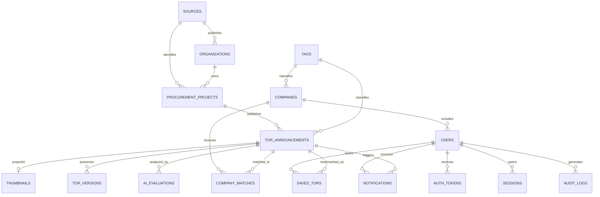

# TOR Software Database Model

The current ingestion workflow writes exactly three collections: `tor_announcements`, `thumbnails`, and `ingestion_runs`. The other collections below support authentication, tagging, AI, and other application features; they are outside the crawler flow. Legacy normalized staging/version collections are optional application extensions, not ingestion requirements.

## Relationship Overview

```mermaid
erDiagram
    SOURCES ||--o{ ORGANIZATIONS : publishes
    SOURCES ||--o{ PROCUREMENT_PROJECTS : identifies
    TOR_ANNOUNCEMENTS ||--o| THUMBNAILS : projectId
    ORGANIZATIONS ||--o{ PROCUREMENT_PROJECTS : owns
    PROCUREMENT_PROJECTS ||--o{ TOR_ANNOUNCEMENTS : publishes
    TOR_ANNOUNCEMENTS ||--o{ TOR_VERSIONS : preserves
    TOR_ANNOUNCEMENTS ||--o{ AI_EVALUATIONS : analyzed_by
    COMPANIES ||--o{ USERS : includes
    TAGS ||--o{ COMPANIES : classifies
    TAGS ||--o{ TOR_ANNOUNCEMENTS : classifies
    USERS ||--o{ AUTH_TOKENS : receives
    USERS ||--o{ SESSIONS : opens
    USERS ||--o{ AUDIT_LOGS : generates
    COMPANIES ||--o{ COMPANY_MATCHES : receives
    TOR_ANNOUNCEMENTS ||--o{ COMPANY_MATCHES : matched_to
    USERS ||--o{ SAVED_TORS : saves
    TOR_ANNOUNCEMENTS ||--o{ SAVED_TORS : bookmarked_as
    USERS ||--o{ NOTIFICATIONS : receives
    TOR_ANNOUNCEMENTS ||--o{ NOTIFICATIONS : triggers
```

The current ingestion identity is a string `projectId`; MongoDB `_id` values remain internal. Optional application references use `ObjectId` values. Relationships are shown here to communicate ownership; MongoDB does not enforce foreign keys automatically.

## 1. `sources`

Stores one record for each monitored public website.

Important fields:

- `code`: stable short name such as `EGP` or `BMA`
- `name`: publisher or source display name
- `baseUrl`: official website root
- `adapterType`: crawler implementation name
- `enabled`: whether scheduled collection is active
- `rawRetentionDays`: source-specific raw staging retention, normally `14`
- `crawlSchedule`: intended collection frequency and timezone
- `lastSuccessfulRunAt`: monitoring value

## 2. `organizations`

Represents agencies, departments, and purchasing units without separate tables for each level.

Important fields:

- `sourceId`: source that supplied the organization
- `externalId`: source-specific identifier when available
- `nameTh` and `nameEn`: display names
- `organizationType`: `agency`, `department`, or `purchasing_unit`
- `parentOrganizationId`: optional parent reference
- `ancestorIds`: ordered parent chain used for agency-wide filtering without recursive queries

## 3. `procurement_projects`

Represents one procurement project. A project can have many announcements or publications over its lifecycle.

Important fields:

- `sourceId`: source that supplied the project
- `externalProjectId`: source-specific project identifier, retained as a string
- `organizationId`: purchasing organization reference
- `title`, `summary`, and optional project-level metadata
- `createdAt` and `updatedAt`

The unique project identity is `sourceId + externalProjectId`.

## 4. `tor_announcements`

One document per project, upserted by **string `projectId`**. A plan ID such as `P69100015073` stays separate from a numeric procurement ID, including when `linkedProjectId` points to that procurement project. Never identify frontend projects using `_id`, a template ID, or a URL. Preserve department IDs such as `"0001"` as strings.

Top-level `templateId`, `announcementType`, and `projectKey` are retired. Raw document parameters, including template IDs when available, remain inside `itemParams` and each stage observation's parameter bags.

| Field | Type | Meaning |
| --- | --- | --- |
| `projectId` | string | Unique source project or plan identity |
| `scope` | string | Currently `department` |
| `linkedProjectId` | string/null | Project ID found in the document URL; does not replace identity |
| `identityScope` | string | `project` or `plan` |
| `title`, `description` | string/null | Latest display text |
| `departmentId`, `departmentName` | string/null | Source department identity and name |
| `procurementMethod` | string/object/null | Source procurement method |
| `publishedAt` | string | Display announcement publication date |
| `url`, `documentUrl` | string/null | Original announcement and document links |
| `thumbnail`, `thumbnailSourceUrl` | string/null | Project thumbnail route and originating document URL |
| `channelParams`, `itemParams` | object | Original source parameters |
| `firstSeenAt`, `lastSeenAt` | string | First sighting is preserved; last sighting changes on ingestion |
| `status` | string | Latest observed RSS stage |
| `statusPublishedAt` | string | Stage publication date, `YYYY-MM-DD` |
| `statusOrderAmbiguous` | boolean | Different stages share the latest publication date |
| `stageObservations` | object | Latest retained observation per stage code |
| `biddingOpenVerified` | boolean | Currently always `false`; invitation publication does not verify open bidding |
| `titleMatchedKeywords` | string[] | Software/IT title keywords matched by ingestion |

### Stage observations and RSS status

| Code | Status |
| --- | --- |
| `P0` | `procurement_planned` |
| `15` | `reference_price_published` |
| `B0` | `draft_tender_published` |
| `D0` | `invitation_published` |
| `W0` | `award_published` |
| `D1` | `invitation_cancelled` |
| `W1` | `award_cancelled` |
| `D2` | `invitation_amended` |
| `W2` | `award_amended` |

Each observation retains its own title, publication date, document links, raw parameters, and timestamps. It retains the latest observation for that stage, **not every historical announcement**. Entries are an unordered keyed object.

When different stages share the latest publication date, use `status: "multiple_announcements_same_day"` and `statusOrderAmbiguous: true`. Display all stages with that latest date individually and allow each to match the stage filter. Do not infer which stage happened last or describe an invitation as verified open bidding.

### Removed enrichment fields

Project documents and API responses must omit these fields entirely, including null or empty placeholders:

`opend`, `opendLookup`, `province`, `district`, `subdistrict`, `projectLocation`, `projectMoney`, `referencePrice`, `totalContractValue`, `contractProjectStatus`, `contracts`, `opendUpdatedAt`, `locationFilter`.

These fields are forbidden by the revised project validator. The API strips them from legacy input, the frontend does not map or display them, and the migration removes them instead of creating defaults. Keep the enrichment step disabled in the external ingestion workflow; its configuration is outside this repository. Project IDs, RSS stages, source parameters, sighting timestamps, and thumbnails remain part of the contract.

Use `npm run db:verify-enrichment-removed` for a read-only check across every project document, including non-EGP sources. It checks `$exists: true`, so even a field whose value is null counts as a failure. The earlier `$unset` command filtered by `sourceId: "EGP"`; it does not affect other sources. Local validator changes take effect when the database setup is applied.

### Indexes and migration

`uq_tors_project_id` is a full unique index on `{ projectId: 1 }`. The old unique template/source-URL indexes and announcement-type index are retired. Discovery indexes support department/publication date, RSS status/date, procurement method, text search, and optional tags.

The ingestion workflow neither migrates old documents nor creates indexes. Use the migration procedure in the README before `db:setup` on an existing database. Setup refuses unmigrated identities before changing validators or indexes. MongoDB `_id` values stay internal; when duplicate documents merge, one existing `_id` survives.

## Thumbnail storage (`thumbnails`)

One thumbnail per string `projectId`, with a full unique `{ projectId: 1 }` index named `uq_thumbnails_project_id`.

| Field | Type |
| --- | --- |
| `projectId` | string |
| `contentType` | string (`image/webp`) |
| `data` | string (base64 image bytes) |
| `sourceUrl` | string |
| `sourcePublishedAt` | string (`YYYY-MM-DD`) |
| `width`, `quality`, `size` | number |
| `updatedAt` | string |

Serve `GET /api/thumbnail/:projectId`: query the exact string ID, check that `sourceUrl` equals the project's current `documentUrl`, decode base64, and return `Content-Type: image/webp`. Return `404` for missing or stale data. Never include base64 image data in project responses.

The frontend polls projects every 30 seconds and independently reloads thumbnails every 30 seconds, including after a `404`. Project and thumbnail updates are independent. Both project document responses and thumbnail responses disable cache retention so old source images cannot remain cached after a document change.

## 5. `tor_versions`

Stores immutable snapshots created only when normalized TOR content changes.

Important fields:

- `torId`, `version`, and `contentHash`
- `changeType`: `created`, `updated`, `cancelled`, or `restored`
- `changedFields`: fields that changed from the previous version
- `snapshot`: normalized source data at that version
- `rawItem`: optional raw source item, not the complete repeated feed
- `capturedAt`

## 6. `ingestion_runs`

Request logs for department/stage RSS ingestion. `announcementType` remains request metadata here; it is not a top-level project field. Department IDs remain strings.

Core fields are `fetchedAt`, `request`, `reportedCount`, `itemsReceived`, and `complete`. `request` retains department and stage parameters. Optional fields include `sourceId`, `channelParams`, and `lastBuildDate`.

Logs retain raw received counts, keyword matched/rejected counts, and completeness. The validator permits the workflow's counters and additional request metadata; `rawReceivedCount`, `keywordMatchedCount`, and `keywordRejectedCount` are supported counter names. Completeness is evaluated against raw feed counts before the software/IT title filter, not the number of retained projects. Historical logs are preserved unchanged during project migration because missing keyword counts cannot be reconstructed reliably.

## 7. `raw_ingestion_items`

Temporarily isolates untrusted crawler output before it can enter the clean TOR collection.

Important fields:

- `ingestionRunId`, `sourceId`, and `environment`
- source URL, source identifiers, announcement key, and content hash
- raw payload or a cloud-storage pointer for large responses
- `processingStatus`: `pending`, `normalized`, `rejected`, or `failed`
- validation errors and an optional normalized preview
- `normalizedTorId` after successful processing, referencing `tor_announcements`
- `expiresAt` for automatic removal, normally 14 days after collection

## 8. `rss_query_state`

Tracks RSS queries and whether all results were retrieved, including split queries and retries.

Important fields:

- `sourceId`, `date`, `departmentId`, `subdepartmentId`, `announcementType`, and `methodId`
- `queryKey`: deterministic identity for the complete query parameter set
- `reportedCount`, `itemsReceived`, and `complete`
- `splitLevel`, `status`, `retryCount`, `nextRetryAt`, `lastCheckedAt`, and `lastIngestionRunId`

The unique query identity is `sourceId + queryKey`.

## 9. `users`

Stores application identity and access data.

Important fields:

- `email`, normalized email, and a secure `passwordHash`
- `profile`: first name, last name, phone, avatar, and job title
- `role`: `company_admin`, `company_member`, `project_manager`, or `system_admin`
- `companyId`: company membership when relevant
- `notificationPreferences.channels`: enabled delivery channels from `in_app` and `email`
- `notificationPreferences.alertTypes`: enabled alerts from `new_match`, `tor_updated`, and `deadline_reminder`
- `notificationPreferences.deadlineReminderDays`: optional reminder lead time from 1–30 days
- `status`: `pending_verification`, `active`, `suspended`, or `disabled`
- email verification, login, password-change, lock, terms-acceptance, and soft-deletion timestamps

## 10. `auth_tokens`

Stores short-lived authentication actions without storing usable raw tokens.

Important fields:

- `type`: `email_verification`, `password_reset`, or `company_invitation`
- `tokenHash`: one-way hash of the token sent to the user
- optional `userId` and `companyId`, plus normalized email
- `expiresAt`, `usedAt`, `revokedAt`, and `createdAt`

The expiry index removes expired records automatically. The raw token belongs only in the email link and must never be saved in MongoDB.

## 11. `sessions`

Stores refresh sessions so the backend can support logout, logout from all devices, and revocation after a password change.

Important fields:

- `userId` and hashed refresh token
- `status`: `active` or `revoked`
- optional user-agent and hashed IP address
- `expiresAt`, `lastUsedAt`, `revokedAt`, and `createdAt`

## 12. `audit_logs`

Records important security and account events.

Important fields:

- actor, target, event, and success/failure outcome
- request ID, optional device details, and safe metadata
- `createdAt`

Recommended events include registration, login success/failure, email verification, password reset, role changes, account suspension, and company verification.

`expiresAt` is optional. When present, the TTL index removes the record at that date. Omit it for security events that must be retained indefinitely or archived under a separate policy.

## 13. `companies`

Stores the software-house profile used for requirement matching and future AI evaluation.

Important fields:

- legal and display names, company size, district, and contact data
- `technologies`: bounded list such as Next.js, Node.js, MongoDB, and Google Cloud
- `qualifications`: certification, capability, and experience evidence
- `profileCompleteness`: profile completion percentage, separate from requirement coverage
- `verificationStatus`: `unverified`, `pending`, `verified`, or `rejected`
- `tagAssignments`: controlled capability tags with provenance, confidence, verification level, review status, and evidence. Profile entries are linked as self-reported `claimed` capabilities and are not independently verified.

## 14. `tags`

Stores the canonical vocabulary used by search, profile review, and matching.

Important fields:

- `name` and `normalizedName`: display and duplicate-check forms
- `slug`: stable API identifier
- `category`: `technology`, `skill`, `certification`, `industry`, `project_type`, `capability`, or `requirement`
- `aliases`: alternative spellings such as `NodeJS` and `Node JS`
- `status`: `active` or `inactive`; deactivate used tags instead of deleting them

TOR and company records reference tags using `tagAssignments`. TOR assignments classify a tag as `required`, `preferred`, or `informational`. Company assignments classify evidence as `claimed`, `experienced`, or `verified`. Every assignment records its source, confidence, and review status so AI suggestions cannot silently become verified facts. Exact company profile values may create/reuse active catalog terms and self-reported company links; this never creates TOR requirements. AI TOR assignments remain `suggested` until a different authorized reviewer approves them.

## 15. `ai_evaluations`

Stores AI-derived information separately from official source facts.

Important fields:

- `torId` and `torVersion`
- `status`: `queued`, `processing`, `completed`, or `failed`
- `retryCount`, `lastAttemptAt`, and `nextAttemptAt`: retry and backoff state used by the worker queue
- `lastError`: structured code, message, and retryable flag for the latest failed attempt
- `requirements`: extracted requirement, category, importance, and evidence
- `budgetObservation`, `riskFlags`, and `summary`
- `model`: provider, name, version, and prompt version
- `generatedAt`

Every AI statement should include evidence text or a page reference when possible. The UI must label this information as AI-generated.

## 16. `company_matches`

Stores the evaluated relationship between one company and one TOR version.

Important fields:

- `companyId`, `torId`, and `torVersion`
- `resultType`: `requirement_match` for current Python comparisons
- `score`: 0–100 requirement coverage, not an AI suitability judgment
- `evidenceScore`: coverage weighted by company evidence strength
- `dataMode`: `demo` or `source`
- `recommendation`: optional legacy field; current requirement matches do not populate it
- `requirementMatches`: met, partial, missing, informational, or unassessed status, with component clauses and profile evidence
- `counts` and `companyCapabilities`: requirement totals and the capabilities used in the comparison
- `status`: `compared` or `requirements_unavailable`
- `strengths`, `gaps`, and `explanation`
- `profileCompleteness`: optional legacy profile completion value, separate from requirement coverage
- `policyVersion`: version of the deterministic scoring policy used
- `computedAt`

Python policy 3 compares saved company technologies and qualifications with reviewed requirements or source-validated AI requirement submissions. In `tor_software_test` only, `MATCHING_DEMO_ENABLED=true` also permits the existing version-matched `BMA-DHR-2026-001` demo requirements. These are explicitly labeled demo data, with no official-source citation asserted. The flow requires no company administrator approval or duplicate profile entry. The engine supplies a core concept vocabulary and uses active catalog aliases; it supports explicit AND/OR clauses and marks unsupported free-form requirements unassessed. Announcement titles alone are not contract requirements. The backend prepares PDF text; AI interpretation remains a separate worker.

Required clauses carry weight 3, preferred clauses weight 1, and informational clauses weight 0. Coverage is separate from evidence strength: claimed (0.5), experienced (0.75), or verified (1.0). Profile text alone remains claimed. Missing requirements reduce coverage without automatically excluding a company. Zero-score comparisons are returned, and zero or unavailable results overwrite previous saved results for the same company/TOR/version. AI suitability recommendations are a separate stage; the current `/api/recommendations` endpoint reports `not_configured` until that stage is connected.

## 17. `saved_tors`

Stores one bookmark per user and TOR.

Important fields:

- `userId` and `torId`
- `note`
- `followUpStatus`: `watching`, `reviewing`, `preparing_bid`, `submitted`, or `dismissed`
- `createdAt` and `updatedAt`

## 18. `notifications`

Tracks in-app and email alerts.

Important fields:

- `eventKey`: idempotency value that prevents duplicate delivery
- `userId`, optional `companyId`, and optional `torId`
- `type`: `new_match`, `tor_updated`, `deadline_reminder`, or `system`
- `channel`: `in_app` or `email`
- `status`: `queued`, `sent`, `failed`, or `read`
- `attemptCount` and `nextAttemptAt`: delivery retry state
- `deliveryError`: structured code, message, and last-attempt timestamp
- `title`, `message`, `createdAt`, `sentAt`, and `readAt`

Workers should query queued or failed records using the `status + nextAttemptAt` index rather than repeatedly scanning all notifications.

## Requirement source snapshots (`requirement_sources`)

The backend stores `torId`, `torVersion`, original `sourceUrl`, resolved URL,
SHA-256 `documentHash`, numbered page text, `fetchedAt`, and `createdAt`.
The compound TOR/version/URL/hash index is unique. AI submissions reference a
snapshot; quotations must exist on their cited page before requirements and
tag links are applied. `ai_evaluations.validation` records the snapshot, source
hash, validation method and demo/source provenance. Requirement clauses contain
AND groups of `anyOfTagIds` alternatives. Current source/version mismatches are
excluded from matching. See the backend AI requirements handoff for the contract.

## Feature-to-Collection Map

| Product feature | Main collections |
| --- | --- |
| Dashboard, search, and filters | `tor_announcements`, `sources`, `organizations`, `tags` |
| Five-source crawler | `sources`, `procurement_projects`, `ingestion_runs`, `tor_announcements`, `tor_versions`, `rss_query_state` |
| Raw crawler validation and cleanup | `ingestion_runs`, `raw_ingestion_items` |
| TOR details, PDF reader, source link | `tor_announcements`, `tor_versions` |
| Company profile and qualifications | `companies`, `users`, `tags` |
| Registration, login, and account recovery | `users`, `auth_tokens`, `sessions`, `audit_logs` |
| AI evaluation | `ai_evaluations`, `tor_announcements` |
| Matching and recommendations | `company_matches`, `companies`, `ai_evaluations`, `tags` |
| Saved TORs and notifications | `saved_tors`, `notifications` |
